<!-- - Software Engineer by trade -->
<!-- - Technoholic and a lifelong learner by nature -->
<!-- - Originally a software engineer, who loves technology and a lifelong learner-->

<!--
  
  

-->

<h1>
  
  Hey There
</h1>

---

  
  

# About Me

[//]: # (- Graphics designer with aesthetics in mind)

- Expert in aesthetics, simplicity, and utility
- Creative Full-Stack Software Engineer, who loves technology and is a lifelong
  learner
- Interested in making things that people want, need, or require

---

## Speciality

- Interactive web design
- Responsive Design
- SPA
- HTML5/CSS3/JS/TS/SASS/JQuery
- React/Nextjs/Nestjs

- React Query
- Three.js
- D3.js
- React Hook Forms/Zod
- Tailwind
- Jest/Vitest
- React Testing Library
- Gsap
- React-Spring
- Automation scripts
- Prompt Engineering

### Main Stack:

[//]: # (<a href="https://www.figma.com/" target="_blank" rel="noreferrer">)

## Database and API

## Code quality

## Ai Stack

### Proficient In:

---

## Place where I host my Experiments

### Front-End:

  
   
  

  
  
  
  
    

### Stacks I have used:

  

  
  
  
  
  

  
  
  

> [!NOTE]
>
> ## I am available for hire. If you have a project in mind, please get in touch with me.

### Connect with me:

[//]: # (<a href="https://calendly.com/ax-sh" target="blank">)
[//]: # (    )
[//]: # (  </a>)

 

<a href="[https://linkedin.com/in/axmin/](https://www.buymeacoffee.com/axsh)" target="blank">

---

## Donate

---

<!--

-->

---

[//]: # (| :---: | | )
[//]: # (Centered Text |)
